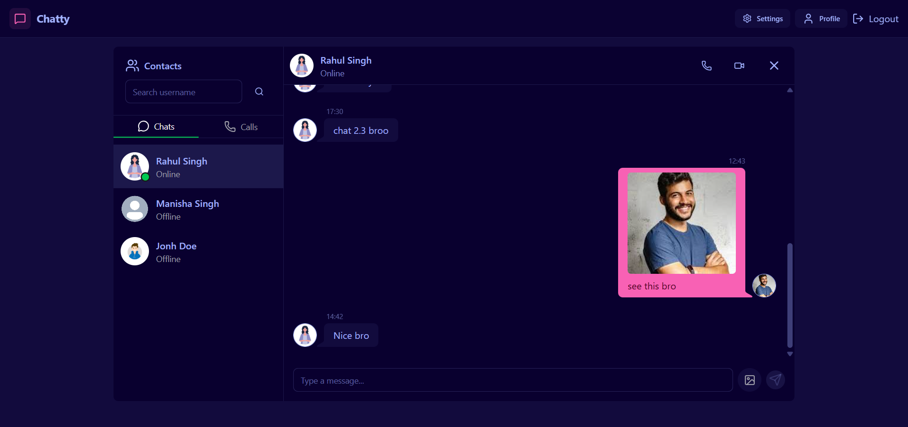
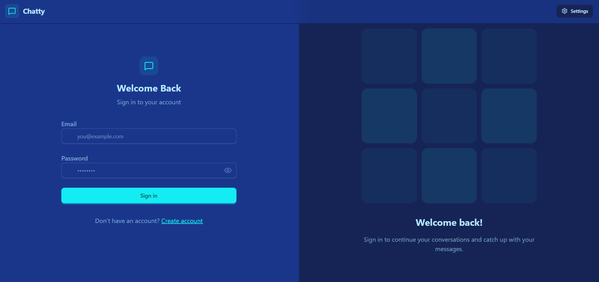
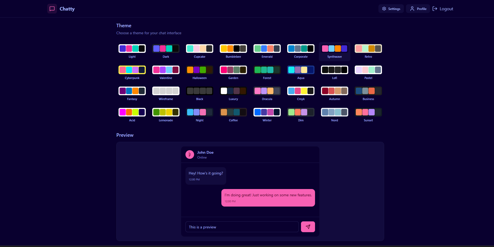

# 💬 Chatly - Real-time Chat Application

A full-stack real-time messaging platform built using the MERN stack and Socket.IO, enabling seamless and low-latency communication between users.

---

## 🚀 Live Demo

https://real-time-chat-app-fawn-alpha.vercel.app/

---

## ✨ Features

* JWT-based Authentication (Signup/Login)
* Real-time messaging using Socket.IO
* Online/Offline user presence tracking
* Instant message delivery (sub-second latency)
* Responsive UI (mobile + desktop)
* Dynamic contact list management

---

## 📸 Screenshots

### 💬 Chat Interface

### 🔐 Login Page

### ⚙️ Settings Page

---

## 🛠️ Tech Stack

Frontend:

* React.js
* Tailwind CSS

Backend:

* Node.js
* Express.js

Database:

* MongoDB

Real-time:

* Socket.IO

---

## ⚙️ Installation & Setup

Clone the repository:
git clone https://github.com/RjDevV/real-time-chat-app.git

Backend setup:
cd backend
npm install
npm start

Frontend setup:
cd frontend
npm install
npm run dev

---

## 💡 Key Highlights

* Supports 100+ concurrent users
* Handles 1000+ real-time messages
* Optimized REST APIs (~25% improvement)
* Scalable MERN architecture

---

## 📬 Contact

Ranjan Singh
[ranjansingh@gmail.com](mailto:ranjansingh@gmail.com)
